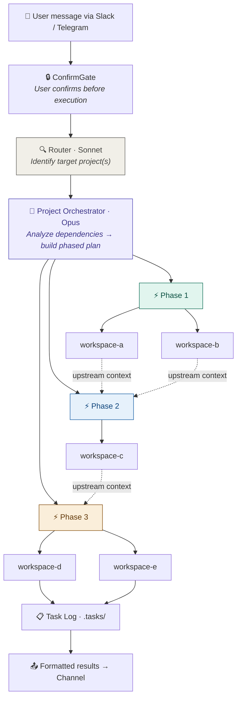
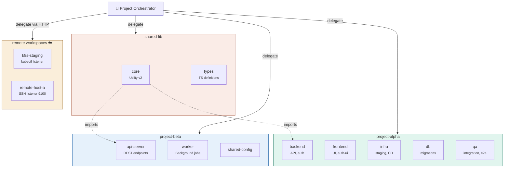
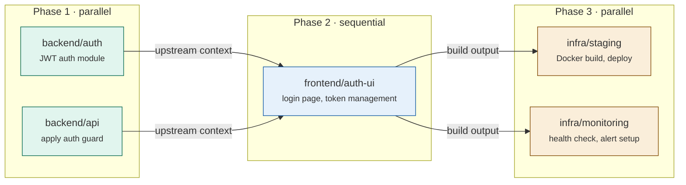
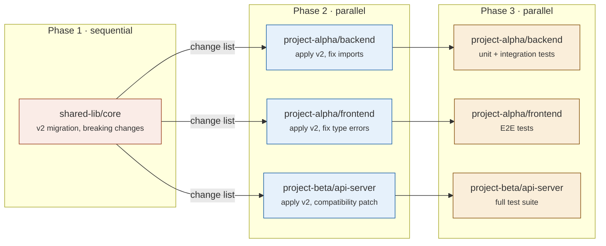
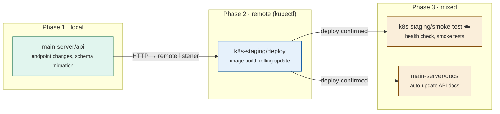
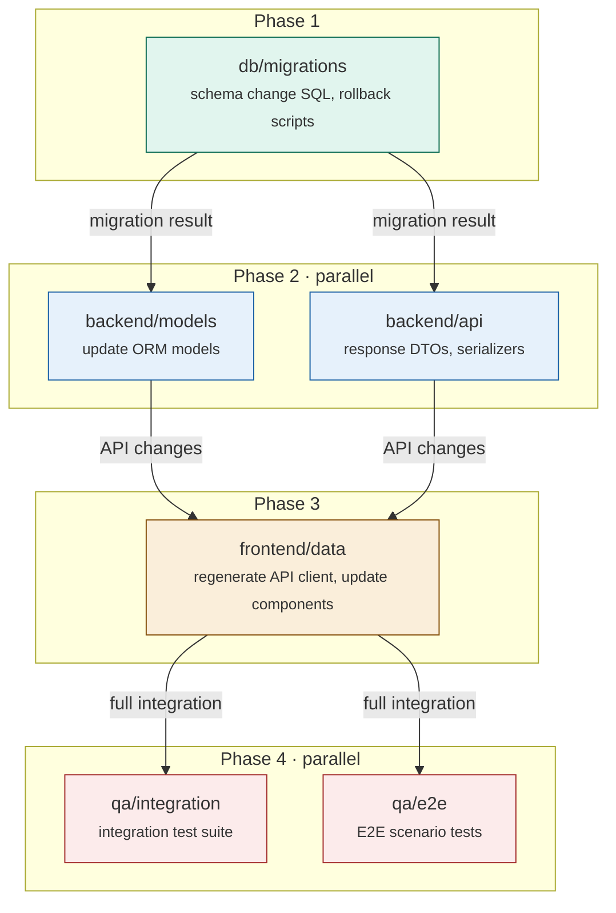

# Claude-Code-Tunnels

**Turn any folder of projects into an AI-orchestrated workspace with Slack and Telegram integration.**

Claude-Code-Tunnels is a plugin that creates a **Project Orchestrator (PO)** layer on top of [Claude Code CLI](https://docs.anthropic.com/en/docs/claude-code). Send a message from Slack or Telegram — the orchestrator analyzes your request, identifies the right project and workspaces, creates an execution plan with dependency-aware phases, delegates work to workspace-level Claude agents, and returns structured results.

```
 Slack / Telegram
          │
    ┌─────▼─────┐
    │  Channel   │  (receive message, confirm gate)
    │  Adapter   │
    └─────┬─────┘
          │
    ┌─────▼─────┐
    │   Router   │  (identify target project)
    └─────┬─────┘
          │
    ┌─────▼─────┐
    │     PO     │  (analyze request → execution plan with phases)
    └─────┬─────┘
          │
    ┌─────▼─────┐
    │  Executor  │  (run workspaces in parallel/sequential phases)
    │            │
    │  Phase 1:  │──→ [ws-a] [ws-b]  (parallel)
    │  Phase 2:  │──→ [ws-c]         (depends on phase 1)
    └─────┬─────┘
          │
    ┌─────▼─────┐
    │ Task Log   │  (.tasks/ with 30-day retention)
    └─────┬─────┘
          │
    ┌─────▼─────┐
    │  Channel   │  (send formatted results back)
    └───────────┘
```

---

## Why This Over Claude Code's Built-in Channels?

Claude Code [recently introduced Channels](https://docs.anthropic.com/en/docs/claude-code/channels) (research preview) — a way to push messages from Telegram/Discord into a running CLI session. Here's why Claude-Code-Tunnels is fundamentally different:

| Feature | Claude Code Channels | Claude-Code-Tunnels |
|---------|---------------------|---------------------|
| **Architecture** | Single CLI session, single cwd | Always-on server with multi-project orchestration |
| **Session model** | Session-bound (stops when CLI closes) | Background daemon (survives disconnects) |
| **Multi-project** | One session = one project | PO routes to any project, runs multiple in parallel |
| **Workspace orchestration** | None — flat message bridge | Phase-based dependency analysis, parallel execution, upstream context passing |
| **Supported channels** | Telegram, Discord (preview) | **Slack, Telegram** |
| **ConfirmGate** | None | Built-in: user must confirm before execution starts |
| **Task logging** | None | `.tasks/` auto-logging with 30-day retention |
| **Remote workspaces** | Not possible | SSH/kubectl listener for external machines and K8s pods |
| **Conversation memory** | Single session context | Per-source session with turn history and state machine |
| **Custom channels** | Requires `--dangerously-load-development-channels` | Python `BaseChannel` inheritance — add any channel in minutes |
| **Security model** | Sender allowlist only | XML tag isolation + path traversal prevention + prompt injection defense |
| **Runtime** | Requires Bun | Python only (`pip install`) |
| **Enterprise** | Needs org-level `channelsEnabled` toggle | Self-hosted, no org restrictions |
| **Permission model** | Interactive prompts block execution | `bypassPermissions` for unattended operation |

**In short**: Claude Code Channels is a raw message bridge into a single session. Claude-Code-Tunnels is a full orchestration layer that manages multiple projects, plans execution, handles dependencies, and logs everything.

---

## How Delegation Works

The core value of Claude-Code-Tunnels is **delegation** — even with dozens of projects and workspaces, the PO analyzes a single natural-language request, identifies the right targets, builds a dependency-aware execution plan, and delegates each piece to the appropriate workspace agent. You never have to specify which project or workspace to touch.

### Delegation Flow



> **Key insight**: Phase 1 workspaces run **in parallel**. Phase 2 waits for Phase 1 to complete and receives its results as **upstream context**. This means downstream workspaces always have the full picture of what changed upstream.

### Workspace Structure

The PO delegates across multiple projects and workspaces. Each project contains independent workspaces that can be targeted individually or as a group:



### Delegation Scenarios

Below are four real-world scenarios showing how a single message gets decomposed into phased, dependency-aware workspace tasks.

#### Scenario 1 — Multi-project deployment

> **Slack**: _"Add an auth module to the backend API, integrate the login UI on the frontend, then deploy to staging"_



| Phase | Mode | Workspaces | What happens |
|-------|------|------------|-------------|
| 1 | **Parallel** | `backend/auth`, `backend/api` | JWT module + guard applied simultaneously |
| 2 | Sequential | `frontend/auth-ui` | Receives Phase 1 API changes as context |
| 3 | **Parallel** | `infra/staging`, `infra/monitoring` | Deploy + monitoring setup after frontend ready |

#### Scenario 2 — Cross-project refactoring

> **Telegram**: _"Upgrade the shared utility library to v2 and run tests across all dependent projects"_



The PO identifies that `shared-lib` must be updated **first**, then fans out to all dependent projects **in parallel**, and finally runs each project's test suite.

#### Scenario 3 — Remote workspace orchestration

> **Telegram**: _"Update the main server API and apply the changes to the K8s staging pod"_



Remote workspaces are delegated over HTTP — the executor sends tasks to a lightweight listener running on the remote host or K8s pod, which runs `claude-agent-sdk query(cwd=...)` locally.

#### Scenario 4 — 4-phase complex pipeline

> **Slack**: _"DB schema change → backend migration → frontend update → full integration tests"_



Each phase strictly depends on the previous one. The PO ensures that no workspace starts until its upstream dependencies are fully resolved and their context is passed down.

---

## Quick Start

```
# 1. Install the plugin
/plugin install claude-tunnels@claude-tunnels

# 2. Go to your project directory and run the setup wizard
cd /path/to/your/projects
/setup-orchestrator
```

The `/setup-orchestrator` command will interactively:
1. Ask for your project root path
2. Copy the orchestrator code
3. Discover your workspaces
4. Connect your preferred channel (Slack/Telegram)
5. Test the connection

---

## Commands

| Command | Description |
|---------|-------------|
| `/setup-orchestrator` | Full installation wizard — copies code, discovers workspaces, connects channels |
| `/connect-slack` | Add Slack channel to an existing orchestrator |
| `/connect-telegram` | Add Telegram channel to an existing orchestrator |
| `/setup-remote-project` | Deploy listener on a remote host (SSH/kubectl) for remote project access |
| `/setup-remote-workspace` | Connect a specific remote workspace to the orchestrator |

---

## Architecture

### Component Overview

```
your-projects/
├── orchestrator/                 # The brain
│   ├── __init__.py              # Config loading, JSON extraction
│   ├── main.py                  # Entry point (starts enabled channels)
│   ├── server.py                # ConfirmGate, handle_request, format_results
│   ├── router.py                # Lightweight project identification (Sonnet)
│   ├── po.py                    # Execution plan generation (Opus)
│   ├── executor.py              # Phase-based workspace execution
│   ├── direct_handler.py        # Non-project tasks (customizable)
│   ├── task_log.py              # .tasks/ logging with retention
│   ├── sanitize.py              # Prompt injection defense
│   ├── http_api.py              # External HTTP gateway
│   ├── channel/
│   │   ├── base.py              # Abstract channel + session state machine
│   │   ├── session.py           # Per-source conversation tracking
│   │   ├── slack.py             # Slack Socket Mode + Web API
│   │   └── telegram.py          # Telegram long-polling + Bot API
│   └── remote/
│       ├── listener.py          # HTTP listener for remote workspaces
│       └── deploy.py            # SSH/kubectl deployment helpers
├── orchestrator.yaml             # Configuration
├── start-orchestrator.sh         # Launch script
├── ARCHIVE/                      # Credentials (never commit)
├── .tasks/                       # Execution logs (auto-generated)
├── .claude/rules/                # Orchestrator behavior rules
├── CLAUDE.md                     # Project-level instructions
├── project-a/                    # Your projects
│   ├── CLAUDE.md
│   └── workspace-1/
└── project-b/
    └── ...
```

### Agent Model Strategy

| Agent | Model | Max Turns | Role |
|-------|-------|-----------|------|
| Router | Sonnet | 8 | Fast project identification |
| PO | Opus | 15 | Deep planning with dependency analysis |
| Executor | Default | 100 | Full workspace code modification |
| DirectHandler | Sonnet | 30 | Misc tasks (no workspace) |
| JSON Repair | Haiku | 1 | Cost-effective malformed JSON recovery |

### Session State Machine

```
[User sends message]
    │
[IDLE] → create_request() → send confirm message
    │
[PENDING_CONFIRM] ← user sends "yes" or "cancel"
    ├── "yes"    → confirm() → handle_request()
    ├── "cancel" → cancel request → IDLE
    └── other    → treat as new request
    │
[EXECUTING] ← handle_request() processing
    │
[AWAITING_FOLLOWUP] ← results sent
    ├── "done"/"end" → session cleared
    └── other        → new request (preserves context)
```

### Execution Flow

1. **Message arrives** via channel adapter (Slack/Telegram)
2. **ConfirmGate** registers request, asks user to confirm
3. **Router** (Sonnet) identifies target project(s)
4. **PO** (Opus) reads project structure, creates execution plan with phases
5. **Executor** runs workspaces — parallel within phase, sequential between phases
6. **Upstream context** passes from completed phases to downstream workspaces
7. **Task log** records everything to `.tasks/{date}/{project}/`
8. **Results** formatted and sent back to the channel

---

## Remote Workspaces

When your projects live on different machines or Kubernetes pods, use remote workspaces:

```
                  Orchestrator Host
                  ┌─────────────┐
                  │  Executor    │
                  │              │──── HTTP ────→ Remote Host A
                  │  query(cwd=) │               ┌──────────┐
                  │  for local   │               │ listener  │
                  │  workspaces  │               │ port 9100 │
                  │              │               └──────────┘
                  │              │──── HTTP ────→ K8s Pod B
                  └─────────────┘               ┌──────────┐
                                                │ listener  │
                                                │ port 9100 │
                                                └──────────┘
```

### Setup

```bash
# Via SSH
/setup-remote-project
# → Enter: host, user, remote path, port

# Via kubectl
/setup-remote-workspace
# → Enter: pod, namespace, remote path, port
```

The listener is a lightweight HTTP server that receives tasks and executes `claude-agent-sdk query(cwd=local_path/)` on the remote machine. Requirements on the remote host:
- Python 3.10+
- `claude-agent-sdk` and `aiohttp` installed
- Claude Code CLI in PATH

### Config

Remote workspaces are registered in `orchestrator.yaml`:

```yaml
remote_workspaces:
  - name: my-project/backend    # workspace identifier
    host: 10.0.0.5              # remote host (or pod IP)
    port: 9100                  # listener port
    token: ""                   # optional auth token
```

---

## Channel Setup Guides

### Slack

1. Create app at [api.slack.com/apps](https://api.slack.com/apps)
2. Enable **Socket Mode** → generate app-level token (`xapp-...`)
3. Subscribe to events: `message.channels`, `app_mention`
4. Bot scopes: `chat:write`, `channels:history`, `app_mentions:read`
5. Install to workspace, copy Bot Token (`xoxb-...`)
6. Run `/connect-slack` and enter credentials

### Telegram

1. Open [@BotFather](https://t.me/botfather) on Telegram
2. Send `/newbot`, follow prompts
3. Copy the bot token
4. Run `/connect-telegram` and enter the token

---

## Configuration Reference

`orchestrator.yaml`:

```yaml
# Project root — the directory containing your projects
root: /home/user/my-projects

# Credential storage (never commit this)
archive: /home/user/my-projects/ARCHIVE

# Channel configuration
channels:
  slack:
    enabled: false
  telegram:
    enabled: false

# Remote workspaces
remote_workspaces:
  - name: project/workspace
    host: 10.0.0.5
    port: 9100
    token: ""
```

---

## Credential File Format

All credential files use `key : value` format (spaces around colon):

```
# ARCHIVE/slack/credentials
app_id : A012345
client_id : 123456.789012
client_secret : your-secret
signing_secret : your-signing-secret
app_level_token : xapp-1-xxx
bot_token : xoxb-xxx

# ARCHIVE/telegram/credentials
bot_token : 123456:ABC-DEF1234
allowed_users : username1, username2
```

---

## Security Model

1. **XML Tag Isolation**: User input wrapped in `<user_message>` tags — system prompts explicitly warn agents to ignore instructions inside these tags
2. **Filesystem Validation**: Only real project/workspace directories are accepted
3. **Path Traversal Prevention**: Names with `/`, `\`, `..` are rejected
4. **Sensitive Directory Blocking**: `ARCHIVE/`, `.tasks/`, `.git/`, `.claude/` blocked from task targeting
5. **Workspace Sandboxing**: Each executor agent is confined to its workspace via `cwd=`

---

## Customization

### Adding a Custom Channel

Inherit from `BaseChannel`:

```python
from orchestrator.channel.base import BaseChannel

class MyChannel(BaseChannel):
    channel_name = "mychannel"

    async def _send(self, callback_info, text):
        # Send message via your transport
        ...

    async def start(self):
        # Start receiving messages
        ...

    async def stop(self):
        # Cleanup
        ...
```

Register in `main.py`:
```python
my_ch = MyChannel(confirm_gate)
register_channel("mychannel", my_ch)
```

### Customizing the Direct Handler

Edit `orchestrator/direct_handler.py` to add your organization's tools and APIs to the system prompt. This is where you integrate internal services (Jira, Confluence, monitoring, etc.).

### Customizing Workspace Behavior

Each workspace's `CLAUDE.md` controls how the executor agent behaves. Add build commands, test instructions, coding conventions, etc.

---

## Dependencies

| Package | Required | When |
|---------|----------|------|
| `claude-agent-sdk` | Always | Core orchestration |
| `aiohttp` | Always | HTTP server/client |
| `pyyaml` | Always | Config loading |
| `slack-bolt` + `slack-sdk` | If Slack | Socket Mode |

Telegram uses `aiohttp` (already required).

---

## Running

```bash
# Foreground (see logs in terminal)
./start-orchestrator.sh --fg

# Background (daemon mode)
./start-orchestrator.sh

# Check logs
tail -f /tmp/orchestrator-$(date +%Y%m%d).log

# Stop
kill $(pgrep -f "orchestrator.main")
```

---

## License

MIT
