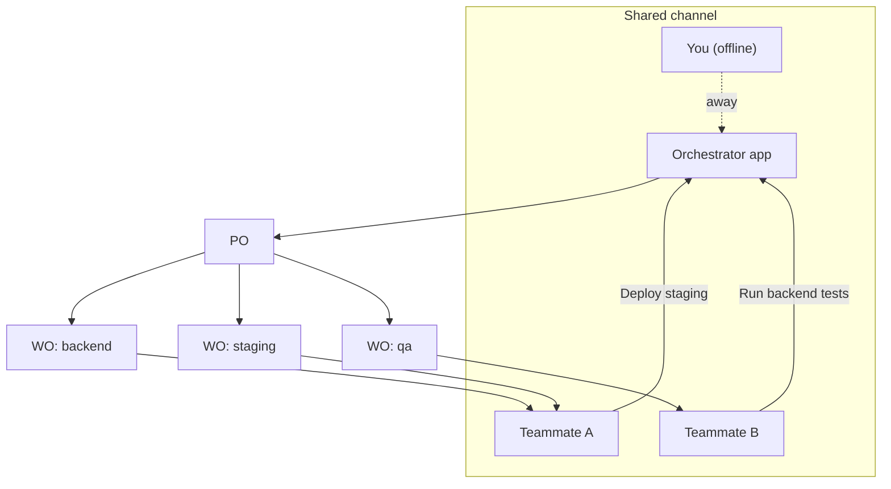
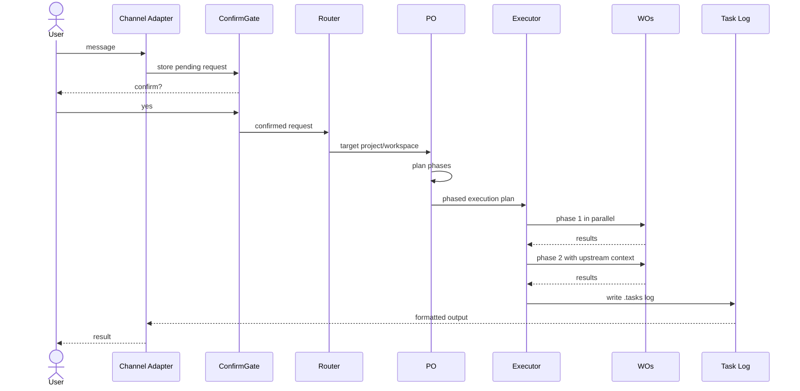
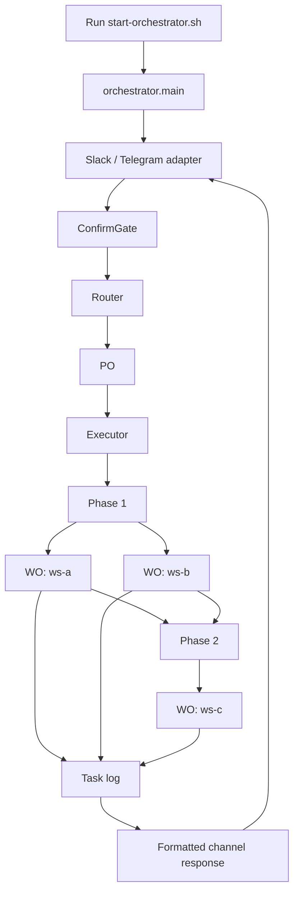
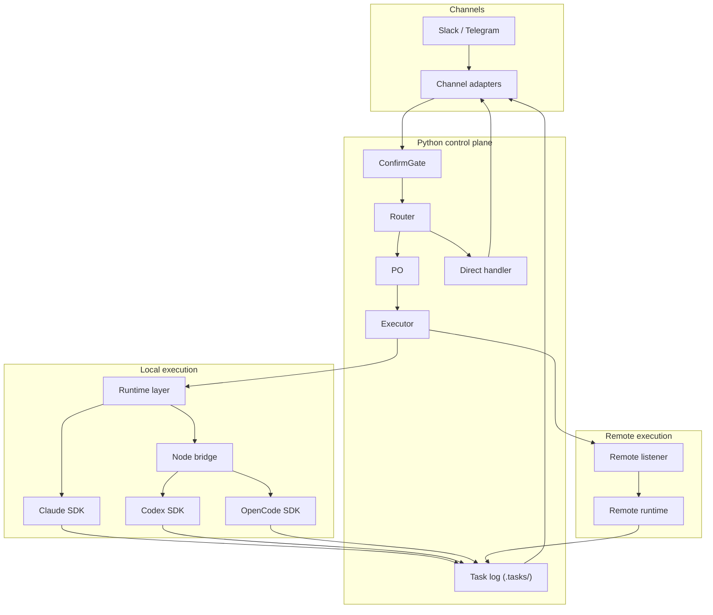
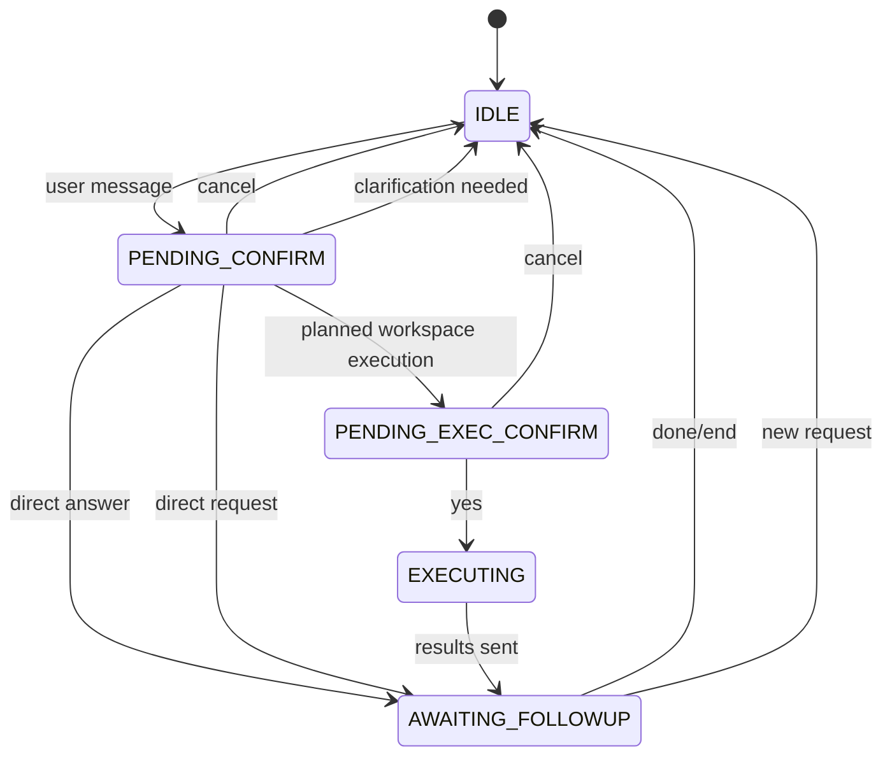

# Claude-Code-Tunnels

**Turn any project folder into an AI-orchestrated workspace with Slack and Telegram integration.**

Claude-Code-Tunnels builds a **Project Orchestrator (PO)** layer on top of your project folders. Send a message from Slack or Telegram and the orchestrator analyzes the request, identifies the right workspace, builds a dependency-aware execution plan, delegates work to **Workspace Orchestrators (WOs)**, and returns structured results.

This branch updates that model for multi-runtime execution:

- `claude` stays on the Python `claude-agent-sdk`
- `codex` runs through a local Node bridge with `@openai/codex-sdk`
- `opencode` runs through a local Node bridge with `@opencode-ai/sdk`
- setup is now driven by a Textual TUI that helps define the `PO`, `Workspaces`, and `WOs`

## Terminology

These terms appear throughout the README:

- **Project Orchestrator (PO)**: The control plane. It receives requests, routes them, builds execution plans, and coordinates execution.
- **Workspace**: A real directory that contains the code or documents to operate on.
- **Workspace Orchestrator (WO)**: The execution unit for one workspace. A WO runs one runtime such as `claude`, `codex`, or `opencode`.
- **Executor**: The component that runs WOs phase by phase, with parallel execution inside a phase and ordered dependencies between phases.
- **Remote Workspace**: A workspace executed through the remote HTTP listener on another host or pod.

---

## Difference from Claude Code's Built-in Channels

Claude Code recently introduced a [Channels feature](https://docs.anthropic.com/en/docs/claude-code/channels) that forwards chat messages to a running CLI session. Claude-Code-Tunnels solves a different problem:

| Feature | Claude Code Channels | Claude-Code-Tunnels |
|---------|---------------------|---------------------|
| **Architecture** | Single CLI session, single working directory | Always-on server with PO + phased workspace orchestration |
| **Session Model** | Session-dependent | Background daemon |
| **Workspace Orchestration** | None | Phase-based dependency analysis and upstream context passing |
| **Supported Channels** | Telegram, Discord (preview) | Slack, Telegram |
| **Confirm Gate** | None | Built-in two-step confirmation |
| **Task Log** | None | `.tasks/` logging |
| **Remote Workspaces** | Not supported | HTTP listener for remote hosts and pods |
| **Runtime** | Single Claude CLI session | Python control plane + Node bridge for Codex/OpenCode |
| **Permissions Model** | Interactive prompts can block flows | unattended execution support |

**In short**: Channels is a message bridge into one session. Claude-Code-Tunnels is an orchestration layer that can coordinate multiple workspaces and runtimes from one shared channel.

---

## Team Collaboration — Shared Channel, Zero Handoff

Traditional setups tie the AI assistant to one person's laptop or one long-running terminal session. Claude-Code-Tunnels flips that: the orchestrator lives in the shared channel, not in one person's shell.



**No handoff required.** The orchestrator already knows workspace structure through configuration and guidance files such as `CLAUDE.md`, `AGENTS.md`, and `.claude/`. A teammate does not need your local terminal state or your memory of "how this repo works."

| Scenario | Without Tunnels | With Tunnels |
|----------|----------------|--------------|
| You're on vacation | Team waits or guesses | Team uses the shared channel |
| New team member joins | Needs project-by-project onboarding | Asks the channel and gets routed correctly |
| Urgent hotfix at 3 AM | Someone SSHs in and runs commands manually | Anyone with channel access can trigger the pipeline |

---

## How Delegation Works

The core value of Claude-Code-Tunnels is **delegation**. The PO reads the request, decides which workspaces are involved, determines dependency order, and hands each workspace-specific task to a WO.

Two properties make that useful:

**1. Isolated workspace execution.** Each WO runs in one workspace with its own runtime and its own working directory.

**2. Phase-aware coordination.** Workspaces in the same phase run in parallel. Downstream phases receive upstream summaries as context.

### Delegation Flow



### Workspace Structure

The current branch is optimized for one `PO` root with an explicit workspace registry:

```text
po-root/
├── orchestrator/
├── orchestrator.yaml
├── start-orchestrator.sh
├── ARCHIVE/
├── backend/
├── frontend/
└── services/
    └── staging/
```

The `workspaces:` block in `orchestrator.yaml` is now the preferred source of truth. Legacy directory scanning still works when that block is missing.

---

## Quick Start

```bash
git clone https://github.com/matteblack9/claude-code-tunnels.git
cd claude-code-tunnels

./install.sh
.venv/bin/python -m orchestrator.setup_tui
./start-orchestrator.sh --fg
```

The setup TUI:

1. checks whether the current folder already looks like a `PO` root
2. suggests the `PO` root, `ARCHIVE` path, and workspace candidates
3. lets you assign one `WO` per selected workspace
4. writes `orchestrator.yaml` and `start-orchestrator.sh`
5. shows the exact commands to run next

---

## How To Run

If you are seeing terms like `PO` and `WO` for the first time, read this section as:

- **PO root**: the directory that contains `orchestrator/`, `orchestrator.yaml`, `start-orchestrator.sh`, and `ARCHIVE/`
- **Workspace**: a real target directory such as `backend/` or `services/staging/`
- **WO**: the runtime worker assigned to one workspace

Operationally, the tree looks like this:



After setup has written `orchestrator.yaml` and `start-orchestrator.sh`, run from the `PO` root:

```bash
# Foreground, recommended for first run or debugging
./start-orchestrator.sh --fg

# Background daemon mode
./start-orchestrator.sh

# Re-open setup
.venv/bin/python -m orchestrator.setup_tui

# Follow logs
tail -f /tmp/orchestrator-$(date +%Y%m%d).log

# Stop background execution
kill $(pgrep -f "orchestrator.main")
```

---

## Commands

| Command | Description |
|---------|-------------|
| `.venv/bin/python -m orchestrator.setup_tui` | Full-screen setup wizard for PO/workspace/WO configuration |
| `/setup-orchestrator` | Plugin skill shortcut that launches the setup workflow |
| `/connect-slack` | Add Slack credentials to an existing orchestrator |
| `/connect-telegram` | Add Telegram credentials to an existing orchestrator |
| `/setup-remote-project` | Deploy the remote listener through SSH or kubectl |
| `/setup-remote-workspace` | Register a specific remote workspace |

---

## Architecture

### Component Structure

```text
po-root/
├── orchestrator/
│   ├── __init__.py              # config loading, workspace/runtime resolution
│   ├── main.py                  # entry point
│   ├── server.py                # ConfirmGate, planning, execution flow
│   ├── router.py                # target identification
│   ├── po.py                    # phased execution planning
│   ├── executor.py              # phase-by-phase WO execution
│   ├── direct_handler.py        # non-workspace task handling
│   ├── task_log.py              # .tasks/ writer
│   ├── setup_tui.py             # Textual setup app
│   ├── setup_support.py         # setup discovery and rendering helpers
│   ├── runtime/
│   │   ├── __init__.py          # runtime-neutral execution layer
│   │   └── bridge.py            # persistent bridge daemon client
│   ├── channel/
│   │   ├── base.py              # shared confirm/cancel/session flow
│   │   ├── slack.py             # Slack adapter
│   │   └── telegram.py          # Telegram adapter
│   └── remote/
│       ├── listener.py          # standalone remote listener
│       └── deploy.py            # SSH/kubectl deployment helper
├── bridge/
│   ├── daemon.mjs               # Node bridge process
│   ├── lib/runtime.mjs          # Codex/OpenCode runtime calls
│   └── tests/runtime.test.mjs
├── templates/
├── skills/
├── orchestrator.yaml
├── start-orchestrator.sh
├── package.json
├── requirements.txt
└── requirements-dev.txt
```

### Multi-Runtime Structure



### Runtime Strategy

| Role | Default runtime | Max turns | Responsibility |
|------|-----------------|-----------|----------------|
| Router | `claude` | 8 | Fast target identification |
| PO | `claude` | 15 | Phased execution planning |
| Executor | `claude` | 5 | Workspace execution |
| DirectHandler | `claude` | 30 | Non-workspace operations |
| JSON Repair | `claude` | 1 | Malformed JSON recovery |

### Runtime Resolution Order

Runtime selection follows this order:

1. `workspaces[].wo.runtime`
2. `runtime.roles[role]`
3. `runtime.default`
4. fallback `claude`

### Session State Machine



### Execution Flow

1. Message received through Slack or Telegram
2. `ConfirmGate` stores the pending request
3. Router identifies the target project or switches to direct handling
4. `PO` builds phased execution
5. Executor runs each phase:
   - parallel within a phase
   - sequential across phases
6. upstream summaries become downstream context
7. results are written to `.tasks/`
8. formatted results are sent back to the channel

---

## Remote Workspaces

Use remote workspaces when the actual workspace lives on another server or pod.

### Listener Environment

The remote listener understands:

- `LISTENER_CWD`
- `LISTENER_PORT`
- `LISTENER_TOKEN`
- `LISTENER_RUNTIME`

### Remote Host Requirements

- Python 3.10+
- `claude-agent-sdk` and `aiohttp` if the remote runtime is `claude`
- `codex` CLI if the remote runtime is `codex`
- `opencode` CLI plus provider credentials if the remote runtime is `opencode`

### Setup

```bash
# Via SSH
/setup-remote-project

# Via kubectl
/setup-remote-workspace
```

The deploy helper in `orchestrator/remote/deploy.py` supports both SSH and `kubectl`.

### Configuration

Preferred new schema:

```yaml
workspaces:
  - id: staging
    path: services/staging
    wo:
      runtime: opencode
      mode: remote
      remote:
        host: 10.0.0.5
        port: 9100
        token: ""
```

Legacy compatibility projection:

```yaml
remote_workspaces:
  - name: staging
    host: 10.0.0.5
    port: 9100
    token: ""
    runtime: opencode
```

---

## Channel Setup Guide

### Slack

Slack support exists in `orchestrator/channel/slack.py`, but Slack libraries are optional.

Install them if you want Slack support:

```bash
.venv/bin/pip install slack-bolt slack-sdk
```

Then:

1. create a Slack app at [api.slack.com/apps](https://api.slack.com/apps)
2. enable Socket Mode
3. generate an app-level token with `connections:write`
4. add bot scopes:
   - `chat:write`
   - `channels:history`
   - `groups:history`
   - `im:history`
   - `mpim:history`
   - `app_mentions:read`
5. subscribe to bot events:
   - `message.channels`
   - `message.groups`
   - `message.im`
   - `app_mention`
6. install the app to the workspace
7. write credentials into `ARCHIVE/slack/credentials`

### Telegram

Telegram support is implemented in `orchestrator/channel/telegram.py`.

1. create a bot with [@BotFather](https://t.me/botfather)
2. write `ARCHIVE/telegram/credentials`
3. enable Telegram in `orchestrator.yaml`

---

## Configuration File Reference

`orchestrator.yaml` now looks like this:

```yaml
root: /path/to/po-root
archive: /path/to/po-root/ARCHIVE

runtime:
  default: claude
  roles:
    router: claude
    planner: claude
    executor: codex
    direct_handler: claude
    repair: claude

channels:
  slack:
    enabled: false
  telegram:
    enabled: true

workspaces:
  - id: backend
    path: backend
    wo:
      runtime: codex
      mode: local

  - id: staging
    path: services/staging
    wo:
      runtime: opencode
      mode: remote
      remote:
        host: 10.0.0.5
        port: 9100
        token: ""
```

Key fields:

- `root`: the `PO` root
- `archive`: credential storage path
- `runtime.default`: default runtime for roles without explicit overrides
- `runtime.roles`: per-role runtime overrides
- `workspaces[].id`: workspace identifier used by the planner and executor
- `workspaces[].path`: actual workspace path relative to `root`
- `workspaces[].wo.runtime`: runtime for that workspace
- `workspaces[].wo.mode`: `local` or `remote`
- `workspaces[].wo.remote`: remote listener connection information

---

## Credential File Format

All credential files use `key : value` format with spaces around the colon.

```text
# ARCHIVE/slack/credentials
app_id : A012345
client_id : 123456.789012
client_secret : your-secret
signing_secret : your-signing-secret
app_level_token : xapp-1-xxx
bot_token : xoxb-xxx

# ARCHIVE/telegram/credentials
bot_token : 123456:ABC-DEF1234
allowed_users : username1, username2
```

---

## Security Model

1. User-controlled input is isolated inside explicit XML-like tags
2. Workspace and project identifiers are validated before execution
3. Path traversal is rejected
4. Sensitive directories such as `ARCHIVE`, `.tasks`, `.git`, `.claude`, and `orchestrator` are blocked from target selection
5. Local workspace execution is restricted by `cwd`
6. Channel execution is guarded by confirmation state

---

## Customization

### Add a Custom Channel

Inherit from `BaseChannel` in `orchestrator/channel/base.py`, then register it in `orchestrator/main.py`.

### Customize the Direct Handler

Adjust the system prompt in `orchestrator/direct_handler.py` to integrate your own internal tools or policies.

### Customize Workspace Behavior

Control WO behavior through guidance files:

- `CLAUDE.md` for Claude-oriented workflows
- `AGENTS.md` for Codex and OpenCode-oriented workflows
- `.claude/` for existing Claude memory and rules

The setup flow creates root-level `CLAUDE.md` and `AGENTS.md` when missing. Workspace-level guidance remains under your control.

---

## Dependencies

### Python

- `claude-agent-sdk`
- `aiohttp`
- `pyyaml`
- `requests`
- `textual`

### Node

- `@openai/codex-sdk`
- `@opencode-ai/sdk`

### Optional

- `slack-bolt` and `slack-sdk` for Slack

---

## Running

```bash
# Foreground
./start-orchestrator.sh --fg

# Background
./start-orchestrator.sh

# Logs
tail -f /tmp/orchestrator-$(date +%Y%m%d).log

# Reconfigure
.venv/bin/python -m orchestrator.setup_tui
```

---

## License

MIT
